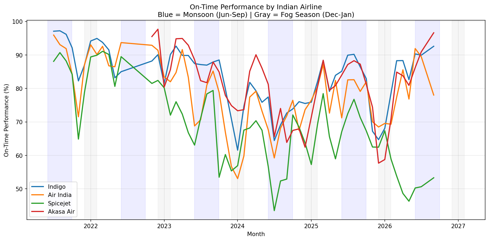
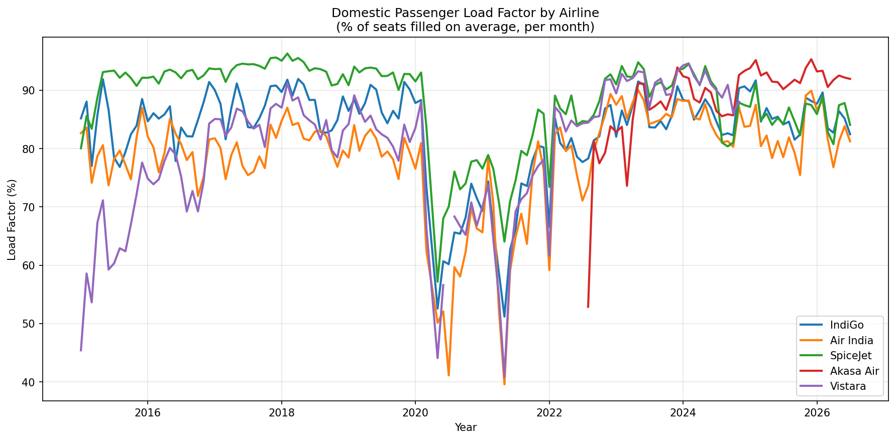
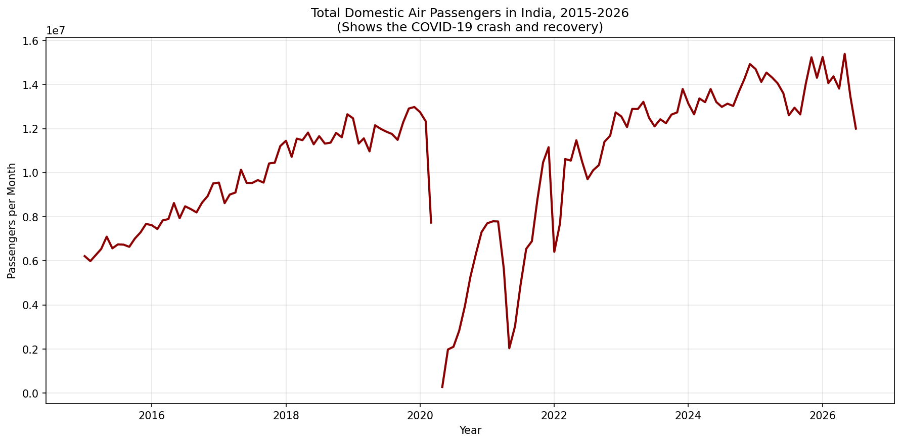

# Indian Airline On-Time Performance Analysis

Analyzing on-time performance (OTP) trends for major Indian airlines using
data from India's Directorate General of Civil Aviation (DGCA) and the
Ministry of Civil Aviation.

## The Question

How does on-time performance vary across India's major airlines, and does
seasonality (monsoon, winter fog) meaningfully affect reliability?

## Data Source

Daily OTP reports (2021–2026) sourced from the Ministry of Civil Aviation,
compiled by the [india-aviation-traffic](https://github.com/Vonter/india-aviation-traffic)
open dataset. Covers IndiGo, Air India, SpiceJet, Akasa Air, and others.

## Key Findings

- **IndiGo is the most consistently reliable carrier**, typically holding
  85–95% OTP across the full period, with comparatively small seasonal dips.
- **SpiceJet is both the weakest and most volatile performer**, dropping as
  low as ~44% OTP in mid-2024 and again falling below 50% through 2026,
  while other carriers recovered in the same periods.
- **Air India and Akasa Air track each other closely** in the 60–90% range,
  both showing more month-to-month swings than IndiGo.
- Seasonal effects (monsoon: Jun–Sep, fog: Dec–Jan) are visible but not
  uniform — some airlines absorb bad-weather periods better than others,
  suggesting operational resilience varies as much as external conditions.

## Chart



## Methodology

1. Loaded daily OTP reports and parsed dates.
2. Tagged each row with a season (Monsoon / Fog / Other).
3. Converted percentage strings to numeric values and handled missing data.
4. Aggregated to monthly averages per carrier.
5. Plotted trends with seasonal periods shaded for visual comparison.

## Tech Stack

Python, pandas, matplotlib

## Running It

```bash
python3 otp_analysis.py
```

Requires `daily.csv` in the same folder (see Data Source above).

## Part 2: Passenger Load Factor & Industry Growth

While Part 1 looked at reliability, this section looks at demand — how
full flights are, and how the overall Indian aviation industry has grown
(or crashed) over the past decade.

### Key Findings

- **SpiceJet has the highest load factor of any major carrier** despite
  having the weakest on-time performance from Part 1 — its planes are
  consistently the fullest, but least likely to run on schedule.
- **The entire industry collapsed in 2020**, with monthly domestic
  passengers falling from ~13 million to near zero during COVID-19
  lockdowns, followed by a second dip in early 2021 during the second wave.
- **Recovery has been strong** — by 2026, monthly domestic passenger
  traffic exceeds pre-COVID 2020 levels by roughly 15-20%.

### Charts




### Methodology

1. Filtered to scheduled domestic flights only (excludes charters).
2. Built monthly load factor trends for the five major carriers.
3. Used DGCA's industry-wide "Total Domestic" figures to track overall
   passenger volume, 2015-2026.

### Running It

```bash
python3 traffic_analysis.py
```

Requires `carrier.csv` in the same folder.

## Credits

Data compiled by [Vonter/india-aviation-traffic](https://github.com/Vonter/india-aviation-traffic)
from DGCA and Ministry of Civil Aviation public reports.
